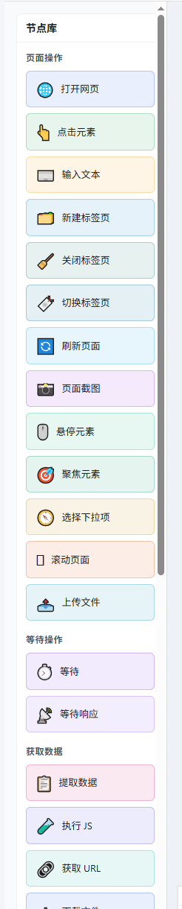
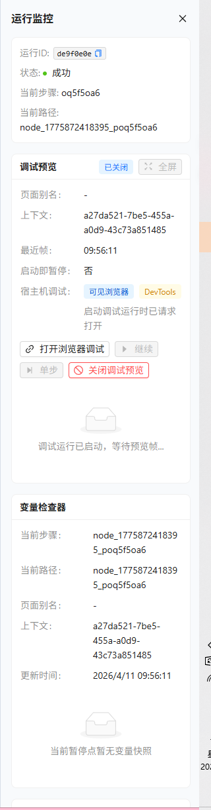
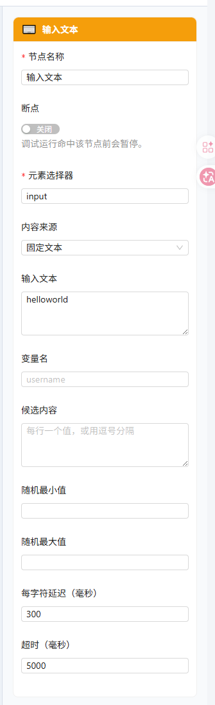
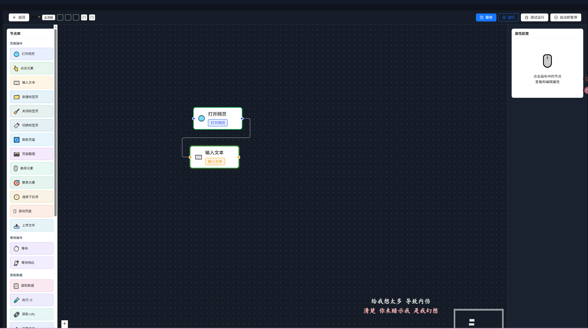
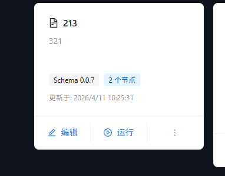

## 0.0.7体验反馈

1. 左侧编辑栏ui太丑：

右侧和滚动条间距太近导致看着左右间距不平衡；图标太丑，目前我的建议是将所有图标统一大小，制作成svg黑白图标，每一类步骤都采用相同的纯色绘制，放弃步骤底部的背景色变成浅灰色；每个分类的标题应该更显眼一点，可以再大一个字号（至少也需要和步骤名称有很明显的对比）

2. 右侧的调试结果面板会有点信息密度太高了。比如"node_1775872418395_poq5f5oa6"这类信息是不应该直接显示给用户的，用户不会知道这个是哪个节点，你更应该采用类似"输入文本"这种直接显示步骤名，然后允许用户hover这个标题就会高光节点；上下文、当前路径这两个也需要换一种更直观的方式展示；目前这个侧边栏信息密度太高，需要精简一点信息，比如只展示前两个板块（基础信息+调试预览），其余板块挪动到详情中（增加一个按钮允许用户点击之后展开后续内容），然后调试预览中的几个按钮需要排列的规整一点并且尝试做大一点，因为这个是用户常用的。

3. 不应该在画布编辑界面出现总的滚动条

4. 这么多配置项看着会很迷惑，需要增加一个tips图标，hover时悬浮一个小提示气泡显示提示文本。

 

5. 暗色状态下的很多地方颜色不对

6. 为什么点击运行会进入编辑页，但是不会自动开始运行？

7. 调试运行也就是比正常运行多一个浏览器预览的功能，那为什么默认执行完之后会直接关闭浏览器呢？不应该是停止执行，然后保持着浏览器开启让用户继续调试吗？