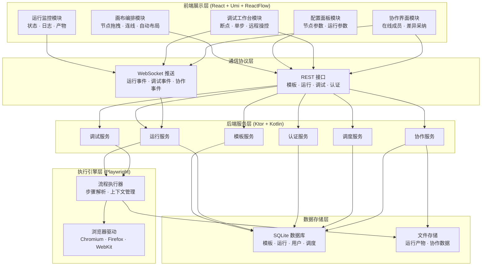
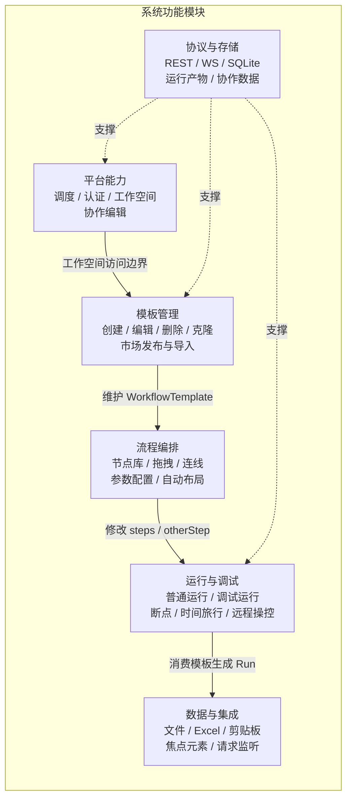
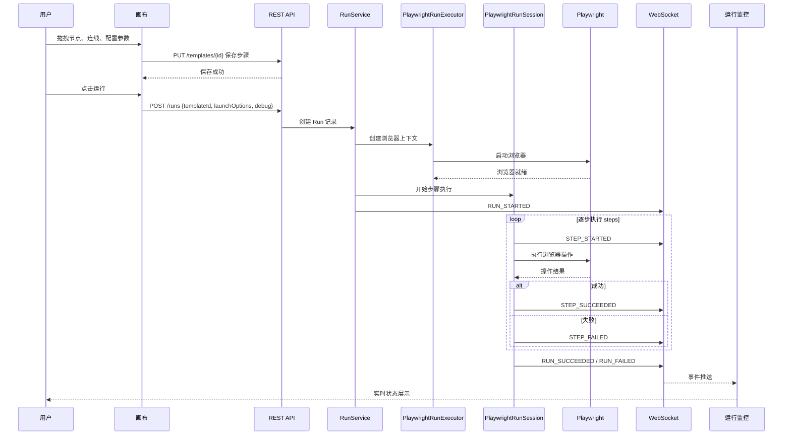
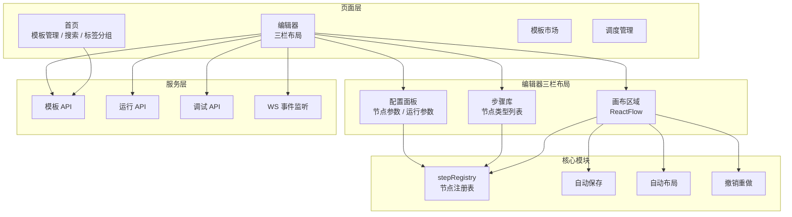
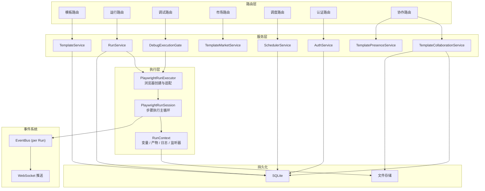
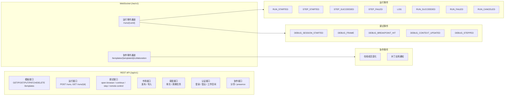
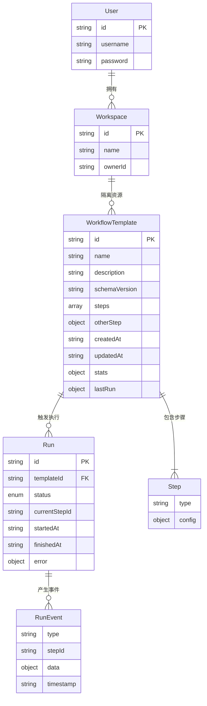

# TheTower 系统架构图

导语：本文档以 Mermaid 图表呈现 TheTower 系统的整体架构、模块划分、执行链路与数据流，帮助读者快速理解系统结构。

## 目录

- [1. 系统总体架构](#1-系统总体架构)
- [2. 系统功能模块](#2-系统功能模块)
- [3. 执行链路](#3-执行链路)
- [4. 前端架构](#4-前端架构)
- [5. 后端架构](#5-后端架构)
- [6. 通信协议](#6-通信协议)
- [7. 数据模型关系](#7-数据模型关系)

## 1. 系统总体架构

TheTower 采用**前后端分离**架构，前端<u>承担</u>可视化编排与交互，后端<u>负责</u>持久化、执行与事件推送，两者通过 REST 与 WebSocket 双轨协议协同。

## 2. 系统功能模块

系统由**六个功能模块**构成，各模块通过统一数据模型与协议<u>协同</u>工作。

| 模块 | 核心职责 | 关键产出 |
|------|----------|----------|
| 模板管理 | 模板生命周期管理与市场复用 | `WorkflowTemplate` CRUD |
| 流程编排 | 画布交互与节点配置 | `steps` + `otherStep` 结构 |
| 运行与调试 | 执行控制与问题定位 | `Run` 记录 + 调试事件流 |
| 数据与集成 | 运行期数据输入输出与观测 | 变量空间 + 产物文件 |
| 平台能力 | 多用户隔离与协作 | 工作空间 + 协作会话 |
| 协议与存储 | 通信标准化与数据持久化 | REST/WS 协议 + SQLite |

## 3. 执行链路

执行链路是系统**最核心的数据通路**，从画布编排到浏览器执行再到状态回传，形成<u>闭环</u>。

## 4. 前端架构

前端以**ReactFlow**为核心，围绕三栏布局组织交互，通过 `stepRegistry` 维护节点注册表保证<u>一致性</u>与可扩展性。

## 5. 后端架构

后端以**Ktor**为 Web 框架，按路由-服务-执行器三层组织，每个运行独立协程并<u>隔离</u>浏览器上下文。

## 6. 通信协议

系统采用**REST 管理 + WebSocket 事件**双轨方案，REST 处理请求响应边界明确的操作，WebSocket <u>推送</u>实时状态变更。

## 7. 数据模型关系

系统核心数据模型围绕**模板**与**运行**两个实体组织，模板是流程定义的持久化载体，运行是模板执行的实例。

总结：TheTower 采用前后端分离架构，前端以 ReactFlow 为核心实现可视化编排，后端以 Ktor + Playwright 构建执行引擎，通过 REST + WebSocket 双轨协议实现编排与执行的解耦，六大功能模块围绕模板与运行两个核心实体协同工作。
